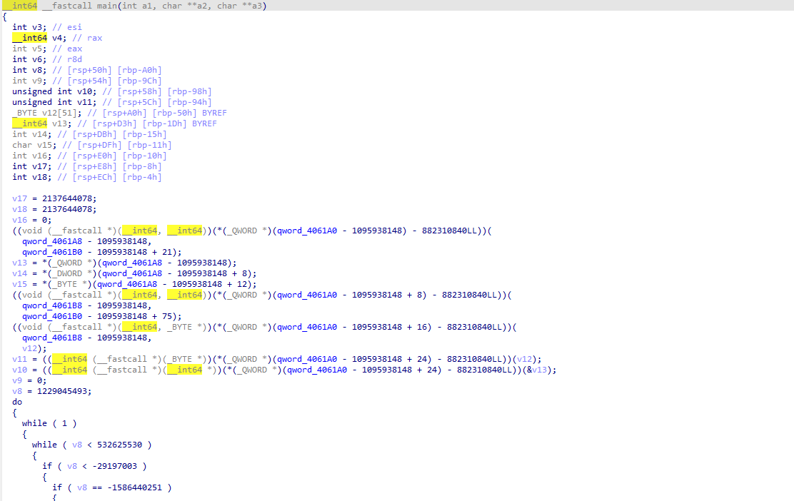
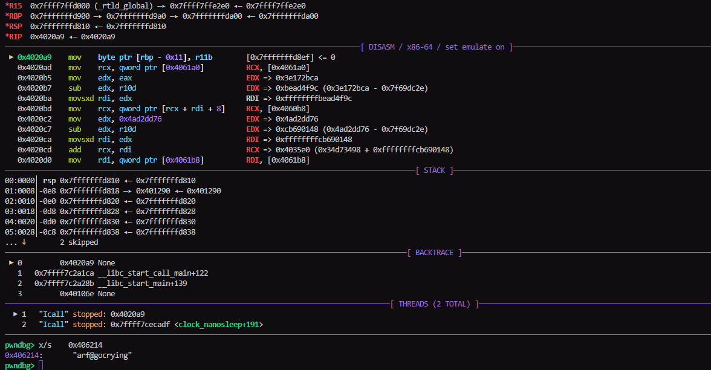

---

In this challenge, a ELF binary was given, during the competition lets now load it into IDA



looks like the main program is heavily obfuscated with pointer encoding and control-flow flattening, during the competition i actually tried to do some debugging with GDB, but i noticed my program will crash because of some anti-debugging method, so off we go to static analysis

there is this part in the `main` function which will be called first because `v8` will be assigned as `1229045493` at first

```c
      if ( v8 < 1651663486 )
      {
        if ( v8 == 1229045493 )
        {
          v3 = v18 + 570882967;
          if ( v12[v9] )
            v3 = v18 - 485980592;
          v8 = v3;
        }
      }
      else if ( v8 == 1651663486 )
      {
        v12[v9] = ((__int64 (__fastcall *)(_QWORD))(*(_QWORD *)(qword_4061A0 - 1095938148 + 32) - 882310840LL))((unsigned int)(char)v12[v9]);
        v8 = v18 + 2128126215;
      }
```

this part will actually do some kind of transformation to our input which is stored in  `v12` as long its not null in which v18 will be 1651663486 and it will assign `v12[v9]` to a new value. The function `(qword_4061A0 - 1095938148 + 32) - 882310840LL` will actually resolve to `0x401C00`, now we can look into the function located at that address

```c
__int64 __fastcall sub_401C00(char a1)
{
  int v1; // edx
  int v2; // edi
  int v3; // edi
  int v4; // esi
  int v6; // [rsp+10h] [rbp-30h]
  int v7; // [rsp+14h] [rbp-2Ch]
  char v9; // [rsp+2Fh] [rbp-11h]
  int v10; // [rsp+3Ch] [rbp-4h]

  v10 = *(_WORD *)(*(_QWORD *)((__int64 (*)(void))(*(_QWORD *)(qword_406198 + 1518159036) - 66708104LL))() + 2LL * a1) & 0x100;
  v6 = -1576811487;
  while ( 1 )
  {
    while ( 1 )
    {
      while ( v6 < -630065159 )
      {
        if ( v6 < -1013558147 )
        {
          if ( v6 < -1266885767 )
          {
            v1 = 1668413646;
            if ( v10 )
              v1 = -1013558147;
            v6 = v1;
          }
          else if ( v6 < -1152562549 )
          {
            v7 = (7 * (a1 - 48) + 11) % 10;
            v4 = -1152562549;
            if ( v7 < 0 )
              v4 = -764946794;
            v6 = v4;
          }
          else
          {
            v9 = v7 + 48;
            v6 = 1433409905;
          }
        }
        else if ( v6 < -788615130 )
        {
          v9 = (7 * (a1 - 65) + 11) % 26 + 65;
          v6 = 1433409905;
        }
        else if ( v6 < -764946794 )
        {
          v9 = (7 * (a1 - 97) + 11) % 26 + 97;
          v6 = 1433409905;
        }
        else
        {
          LOBYTE(v7) = v7 + 10;
          v6 = -1152562549;
        }
      }
      if ( v6 >= 1433409905 )
        break;
      if ( v6 < -624870238 )
      {
        v9 = a1;
        v6 = 1433409905;
      }
      else if ( v6 >= 1321055944 )
      {
        v3 = -624870238;
        if ( (*(_WORD *)(*(_QWORD *)((__int64 (*)(void))(*(_QWORD *)(qword_406198 + 1518159036) - 66708104LL))()
                       + 2LL * a1) & 0x800) != 0 )
          v3 = -1266885767;
        v6 = v3;
      }
      else
      {
        v6 = 2084301942;
      }
    }
    if ( v6 < 1668413646 )
      break;
    if ( v6 < 2084301942 )
    {
      v2 = 1321055944;
      if ( (*(_WORD *)(*(_QWORD *)((__int64 (*)(void))(*(_QWORD *)(qword_406198 + 1518159036) - 66708104LL))() + 2LL * a1) & 0x200) != 0 )
        v2 = -788615130;
      v6 = v2;
    }
    else
    {
      v6 = -630065159;
    }
  }
  return (unsigned int)v9;
}
```

well, another heavily obfuscated function, to cut some time here is the final deobfuscated code of this function which is some kind of character mapping based on affine transformation cipher

```python
def sub_401C00(a):
    if a >= '0' and a <='9':
        tmp = (7 * (ord(a) - ord('0')) + 11) % 10
        tmp+= ord('0')
        return chr(tmp)
    elif a>='a' and a<='z':
        tmp = (7 * (ord(a) - ord('a')) + 11) % 26
        tmp+=ord('a')
        return chr(tmp)
    elif a>='A' and a<='Z':
        tmp = (7 * (ord(a) - ord('A')) + 11) % 26
        tmp+=ord('A')
        return chr(tmp)
    else:
        return a
```

after transforming all of the input it will go into this part

```c
        if ( v8 == -1586440251 )
          {
            ((void (__fastcall *)(_BYTE *, _QWORD, __int64 *, _QWORD, _QWORD))(*(_QWORD *)(qword_4061A0 - 1095938148 + 40)// 0x401b40
                                                                             - 882310840LL))(
              v12,
              v11,
              &v13,
              v10,
              v10);
            ((void (__fastcall *)(_BYTE *, _QWORD, __int64 *, _QWORD, _QWORD))(*(_QWORD *)(qword_4061A0 - 1095938148 + 40)// 0x401b40
                                                                             - 882310840LL))(
              v12,
              v11,
              &v13,
              v10,
              v11);
            ((void (__fastcall *)(_BYTE *, _QWORD, __int64 *, _QWORD, _QWORD))(*(_QWORD *)(qword_4061A0 - 1095938148 + 40)// 0x401b40
                                                                             - 882310840LL))(
              v12,
              v11,
              &v13,
              v10,
              v11 + v10);
            ((void (__fastcall *)(__int64, __int64))(*(_QWORD *)(qword_4061A0 - 1095938148 + 48) - 882310840LL))(
              qword_4061C0 - 1095938148,
              qword_4061B0 - 1095938148 + 132);
            ((void (__fastcall *)(__int64))(*(_QWORD *)(qword_4061A0 - 1095938148 + 56) - 882310840LL))(qword_4061C0 - 1095938148);
            v4 = ((__int64 (__fastcall *)(__int64))(*(_QWORD *)(qword_4061A0 - 1095938148 + 24) - 882310840LL))(qword_4061C8 - 1095938148);
            v5 = ((__int64 (__fastcall *)(_BYTE *, __int64, __int64))(*(_QWORD *)(qword_4061A0 - 1095938148 + 64)
                                                                    - 882310840LL))(
                   v12,
                   qword_4061C8 - 1095938148,
                   v4);
            v6 = v18 - 1607102989;
            if ( v5 )
              v6 = v18 - 1605018548;
            v8 = v6;
          }
```

so basically it will call the function at `0x401b40` 3 times, first one will have the 5th argument to be `v10` (length of `v13`), `v11` (length of input) and finally `v11+v10` (length of `v13` and our input combined), lets look into the function

```c
__int64 __fastcall sub_401B40(__int64 a1, unsigned int a2, __int64 a3, unsigned int a4, unsigned int a5)
{
  _BYTE v6[264]; // [rsp+10h] [rbp-130h] BYREF
  unsigned int v7; // [rsp+118h] [rbp-28h]
  unsigned int v8; // [rsp+11Ch] [rbp-24h]
  __int64 v9; // [rsp+120h] [rbp-20h]
  unsigned int v10; // [rsp+12Ch] [rbp-14h]
  __int64 v11; // [rsp+130h] [rbp-10h]
  int v12; // [rsp+13Ch] [rbp-4h]

  v12 = 66206168;
  v11 = a1;
  v10 = a2;
  v9 = a3;
  v8 = a4;
  v7 = a5;
  ((void (__fastcall *)(_BYTE *, __int64, _QWORD))(*(_QWORD *)(qword_406190 - 92961704) + 1843643116LL))(v6, a3, a4);// 0x4014e0
  return ((__int64 (__fastcall *)(_BYTE *, __int64, _QWORD, _QWORD))(*(_QWORD *)(qword_406190 - 92961704 + 8)// 0x401840
                                                                   + 1843643116LL))(
           v6,
           v11,
           v10,
           v7);
}
```

well it will do another call into `0x4014e0` and `0x401840`

```c
__int64 __fastcall sub_4014E0(__int64 a1, __int64 a2, int a3)
{
  __int64 result; // rax
  int v4; // edx
  int v5; // edx
  int i; // [rsp+1Ch] [rbp-134h]
  _BYTE s[256]; // [rsp+20h] [rbp-130h] BYREF
  int v8; // [rsp+120h] [rbp-30h]
  int v9; // [rsp+124h] [rbp-2Ch]
  int v10; // [rsp+128h] [rbp-28h]
  int v11; // [rsp+12Ch] [rbp-24h]
  __int64 v12; // [rsp+130h] [rbp-20h]
  __int64 v13; // [rsp+138h] [rbp-18h]
  int v14; // [rsp+148h] [rbp-8h]
  int v15; // [rsp+14Ch] [rbp-4h]

  v14 = 953312896;
  v15 = 953312896;
  v13 = a1;
  v12 = a2;
  v11 = a3;
  memset(s, 0, sizeof(s));
  v10 = 0;
  for ( i = -1126335090; i != -628551728; result = (unsigned int)i )
  {
    while ( 1 )
    {
      while ( 1 )
      {
        while ( i < -776628777 )
        {
          if ( i < -1126335090 )
          {
            if ( i < -1342440884 )
            {
              if ( i == -1920256982 )
              {
                *(_BYTE *)(v13 + v10) = v10;
                s[v10] = *(_BYTE *)(v12 + v10 % v11);
                i = v15 - 1738164735;
              }
            }
            else if ( i == -1342440884 )
            {
              v8 = ((unsigned __int8)s[v10] + *(unsigned __int8 *)(v13 + v10) + v8) % 256;
              v9 = ((unsigned __int8)s[v10] + *(unsigned __int8 *)(v13 + v8) + v8) % 256;
              ((void (__fastcall *)(__int64, __int64))(*(_QWORD *)(qword_406180 + 2067789068) - 675034692LL))(
                v9 + v13,
                v8 + v13);
              i = v15 - 1729941673;
            }
          }
          else if ( i < -784851839 )
          {
            if ( i == -1126335090 )
            {
              v4 = v15 + 1078103075;
              if ( v10 < 256 )
                v4 = v15 + 1421397418;
              i = v4;
            }
          }
          else if ( i == -784851839 )
          {
            ++v10;
            i = v15 - 2079647986;
          }
        }
        if ( i >= -628551728 )
          break;
        if ( i < -741556009 )
        {
          if ( i == -776628777 )
          {
            ++v10;
            i = v15 - 1694868905;
          }
        }
        else if ( i == -741556009 )
        {
          v5 = v15 - 1581864624;
          if ( v10 < 256 )
            v5 = v15 + 1999213516;
          i = v5;
        }
      }
      if ( i < 2031415971 )
        break;
      if ( i == 2031415971 )
      {
        v8 = 0;
        v9 = 0;
        v10 = 0;
        i = v15 - 1694868905;
      }
    }
  }
  return result;
}
```

this will actually do some kind of key scheduling function on the array pointed by `a1` or in this function `v13`, it will assign each element of `s[i]` to be equal to `v12[i%v11]` for i = 0 until 256, tracing the value stored in `v12` at initial function call lead us to `v13 = *(_QWORD *)(qword_4061A8 - 1095938148);` in the initial function and `v11` is the length, resolving the arithmetic pointer for `v13` in the main function will actually lead to the address `0x406214` which is in the `.bss` area, this mean the best way to get the value is to dump it during runtime.

I try to trace the anti-debugging function by debugging in using GDB, to cut things short the anti-debugging function will actually be at `sub_4026D0`, to bypass it we can actually change the final part of the function from `return v29 & 1;` to `return 0LL;`, this will bypass the anti-debugging and now we can dump the value stored at `0x406214`



I try breaking at `0x4020A9` in which `0x406214` should already been set and got the value `arf@gocrying`, looks like this will be used as some kind of key for the function at `sub_4014E0`, well back to `sub_4014E0` we already have the key value, so all we need to do is try to reimplement the function to find the value stored at `v13`

```python
def sub_4014E0(key):
    v13=bytearray(range(256))
    s=[key[i%len(key)] for i in range(256)]
    v8=0
    v9=0
    for i in range(256):
        v8 = (s[i]+v13[i]+v8)%256
        v9 = (s[i]+v13[v8]+v8)%256
        v13[v9],v13[v8]=(v13[v8],v13[v9])
    return v13
```

this part looks like the Key-Scheduling Algorithm for RC4, lets keep going into the function `sub_401840`

```
__int64 __fastcall sub_401840(char *a1, __int64 a2, int a3, int a4)
{
  int v5; // esi
  int v6; // esi
  int i; // [rsp+1Ch] [rbp-44h]
  int v8; // [rsp+20h] [rbp-40h]
  char v9; // [rsp+26h] [rbp-3Ah]
  char v10; // [rsp+27h] [rbp-39h]
  int v11; // [rsp+28h] [rbp-38h]
  int v12; // [rsp+30h] [rbp-30h]
  int v13; // [rsp+34h] [rbp-2Ch]

  v9 = *a1;
  v12 = 0;
  v13 = 0;
  v11 = 0;
  for ( i = -1352487153; ; i = 841780568 )
  {
    while ( 1 )
    {
      while ( i < -86367832 )
      {
        if ( i < -498778613 )
        {
          if ( i < -547120796 )
          {
            v5 = -86367832;
            if ( v11 < a3 )
              v5 = 16635716;
            i = v5;
          }
          else
          {
            *(_BYTE *)(a2 + v11) ^= v9 ^ v10;
            v9 = *(_BYTE *)(a2 + v11);
            i = 1776665005;
          }
        }
        else if ( i < -134357446 )
        {
          v13 = (v13 + 1) % 256;
          v12 = ((unsigned __int8)a1[v13] + v12) % 256;
          ((void (__fastcall *)(char *, char *))(*(_QWORD *)(qword_406188 + 2048138584) + 1461912248LL))(
            &a1[v13],
            &a1[v12]);
          v10 = a1[((unsigned __int8)a1[v12] + (unsigned __int8)a1[v13]) % 256];
          i = -134357446;
        }
        else
        {
          ++v8;
          i = 841780568;
        }
      }
      if ( i < 841780568 )
        break;
      if ( i < 1776665005 )
      {
        v6 = -547120796;
        if ( v8 < a4 )
          v6 = -498778613;
        i = v6;
      }
      else
      {
        ++v11;
        i = -1352487153;
      }
    }
    if ( i < 16635716 )
      break;
    v8 = 0;
  }
  return (unsigned int)i;
}
```

this function can be simplified into the following pseudocode

```python
def sub_401840(S, buf, rounds):
    prev = S[0] %256
    i = 0
    j = 0

    for pos in range(32):
        ks = 0  
        for _ in range(rounds):
            i = (i + 1) %256
            j = (j + S[i]) %256
            S[i], S[j] = S[j], S[i]
            ks = S[(S[i] + S[j]) %256]

        buf[pos] ^= (prev ^ ks) %256
        prev = buf[pos] %256
    return buf
```

The value of rounds variable is the 5th arguments of `sub_401B40` which is the length of the key, length of the plaintext and length of the sum of plaintext and the key. 

so we know it's actually a RC4 encryption but with a modification in which the result will be XOR-ed with the previous result value, and finally back to the main function in this part

```
v5 = ((__int64 (__fastcall *)(_BYTE *, __int64, __int64))(*(_QWORD *)(qword_4061A0 - 1095938148 + 64)// memcmp
                                                        - 882310840LL))(
        v12,
        qword_4061C8 - 1095938148,
        v4);
v6 = v18 - 1607102989;
if ( v5 )
    v6 = v18 - 1605018548;
v8 = v6;
```

our stored value will actually be compared with function stored at `qword_4061C8 - 1095938148` or resolved into `0x406020` which store these value

```
.data:0000000000406020                 db 0F7h
.data:0000000000406021                 db  88h
.data:0000000000406022                 db 0C3h
.data:0000000000406023                 db  29h ; )
.data:0000000000406024                 db  36h ; 6
.data:0000000000406025                 db  64h ; d
.data:0000000000406026                 db  63h ; c
.data:0000000000406027                 db  29h ; )
.data:0000000000406028                 db 0C7h
.data:0000000000406029                 db  7Fh ; 
.data:000000000040602A                 db  1Ch
.data:000000000040602B                 db 0ABh
.data:000000000040602C                 db  71h ; q
.data:000000000040602D                 db 0E0h
.data:000000000040602E                 db    3
.data:000000000040602F                 db  49h ; I
.data:0000000000406030                 db  73h ; s
.data:0000000000406031                 db 0CBh
.data:0000000000406032                 db  0Ah
.data:0000000000406033                 db 0AFh
.data:0000000000406034                 db  0Ch
.data:0000000000406035                 db  87h
.data:0000000000406036                 db  84h
.data:0000000000406037                 db  8Eh
.data:0000000000406038                 db  5Ah ; Z
.data:0000000000406039                 db  64h ; d
.data:000000000040603A                 db 0C7h
.data:000000000040603B                 db 0ACh
.data:000000000040603C                 db  2Ah ; *
.data:000000000040603D                 db  67h ; g
.data:000000000040603E                 db    0
.data:000000000040603F                 db    0
```

so `0x406020` will be our target value after the RC4 encryption process, now we just need to implement reverse function to our target value here to get the correct input

```python
def inv_sub_401C00(a):
    if a >= '0' and a <='9':
        tmp = (pow(7,-1,10) * (ord(a) - ord('0') - 11)) % 10
        tmp+= ord('0')
        return chr(tmp)
    elif a>='a' and a<='z':
        tmp = (pow(7,-1,26) * (ord(a) - ord('a') - 11)) % 26
        tmp+=ord('a')
        return chr(tmp)
    elif a>='A' and a<='Z':
        tmp = (pow(7,-1,26) * (ord(a) - ord('A') - 11)) % 26
        tmp+=ord('A')
        return chr(tmp)
    else:
        return a

def sub_4014E0(key):
    v13=bytearray(range(256))
    s=[key[i%len(key)] for i in range(256)]
    v8=0
    v9=0
    for i in range(256):
        v8 = (s[i]+v13[i]+v8)%256
        v9 = (s[i]+v13[v8]+v8)%256
        v13[v9],v13[v8]=(v13[v8],v13[v9])
    return v13

def inv_sub_401840(S, buf, rounds):
    prev = S[0] %256
    i = 0
    j = 0
    ks=[]
    for _ in range(len(buf)): 
        for _ in range(rounds):
            i = (i + 1) %256
            j = (j + S[i]) %256
            S[i], S[j] = S[j], S[i]
        t = S[(S[i] + S[j]) %256]
        ks.append(t)
    out=[]
    for i in range(len(buf)):
        save = buf[i]
        x = buf[i] ^ prev ^ ks[i]
        out.append(x)
        prev = save
    return out


if __name__=='__main__':
    key=b'arf@gocrying'
    target=[0xF7, 0x88, 0xC3, 0x29, 0x36, 0x64, 0x63, 0x29, 0xC7, 0x7F, 
    0x1C, 0xAB, 0x71, 0xE0, 0x03, 0x49, 0x73, 0xCB, 0x0A, 0xAF, 
    0x0C, 0x87, 0x84, 0x8E, 0x5A, 0x64, 0xC7, 0xAC, 0x2A, 0x67]
    a = inv_sub_401840(sub_4014E0(key),target,len(key)+len(target))
    b = inv_sub_401840(sub_4014E0(key),a,len(target))
    c = inv_sub_401840(sub_4014E0(key),b,len(key))
    c = [inv_sub_401C00(chr(i)) for i in c]
    print(''.join(c))
```

we will get the correct input as `flag{r0uNd_Rc4_Aff1neEnc1yp7!}` which is the flag

---