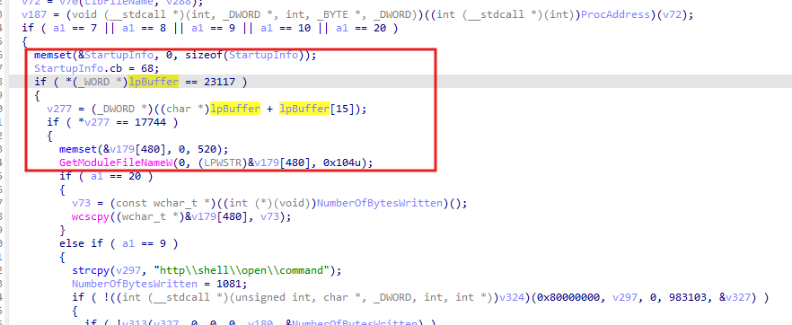
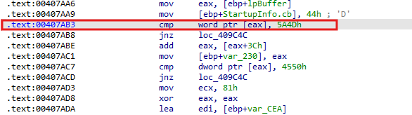
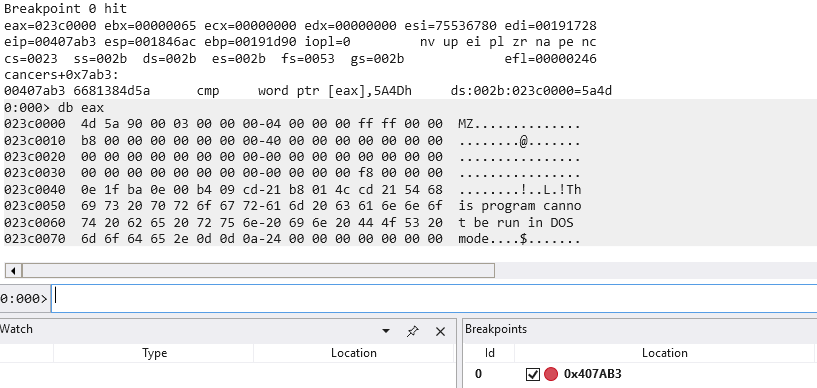
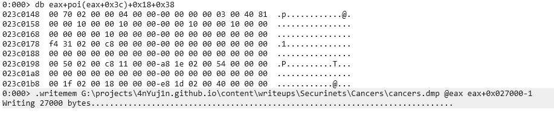
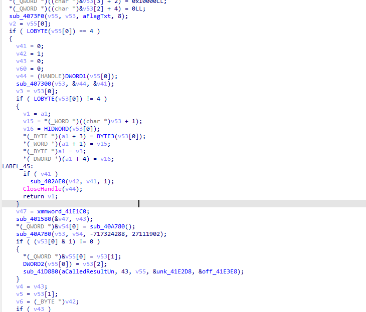
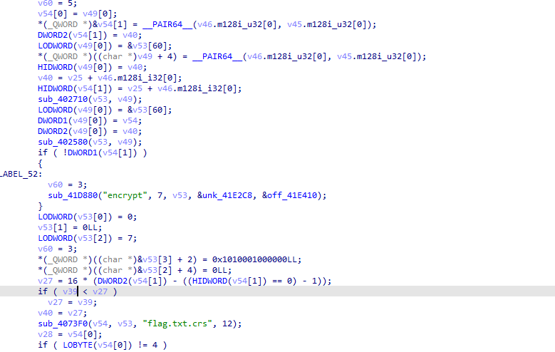
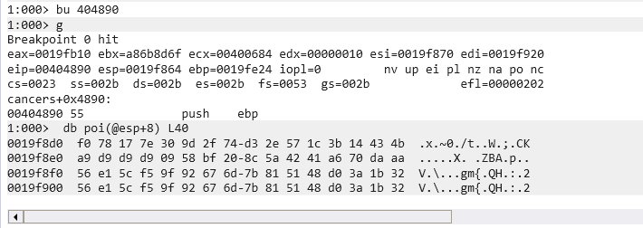

---
### Initial Analysis

A Windows PE binary and a encrypted text was given, looking into the PE binary using the `file` command will show that the binary was actually packed using UPX, I immediately unpack using the unpacker provided by [UPX packer](https://github.com/upx/upx) 

`upx.exe -d cancers.exe`

looking into the binary, a interesting function can be found at `sub_405A10`, the function do a lot of things, looking into the strcpy at the function which will be used later on as dynamic function call, it looks like the function will unpack something and write using VirtualAlloc / VirtualAllocEx and create child process using CreateProcessA / CreateProcessW

```
strcpy(v270, "CreateProcessA");
strcpy(v269, "CreateProcessW");
strcpy(v251, "VirtualAlloc");
strcpy(v244, "VirtualAllocEx");
```

---
### Dumping the binary

on this part, all the dynamic calling should be done and then the binary will be stored at lpbuffer



Then load the binary into windbg and break in the address where the compare method will be done





After that try to dump the binary located at eax, the image size can be extracted from the IMAGE_OPTIONAL_HEADER



---

### Dumped Binary Analysis

looking into the used strings, a interesting function can be found at `sub_401750`



the function will open a handle to the file named "flag.txt" (the value of `aFlagTxt`) and later on will be stored in `v6` it will then be encrypted and later on stored in flag.txt.crs



well lets look into the encryption parts, here is the first part which will be some kind of XOR

```
v47 = xmmword_41E1C0;
sub_401580(&v47, v43);
*(_QWORD *)&v54[0] = sub_40A780();
sub_40A7B0(v53, v54, -717324288, 27111902);
if ( (v53[0] & 1) != 0 )
{
    *(_QWORD *)&v55[0] = v53[1];
    DWORD2(v55[0]) = v53[2];
    sub_41D880(aCalledResultUn, 43, v55, &unk_41E2D8, &off_41E3E8);
}
v4 = v43;
v5 = v53[1];
v6 = (_BYTE *)v42;
if ( v43 )
{
    v39 = v53[1];
    do
    {
    v45.m128i_i32[0] = v4;
    v46.m128i_i32[0] = HIDWORD(v47);
    v7 = v46.m128i_i32[0] ^ v47 ^ ((_DWORD)v47 << 11) ^ ((unsigned __int32)v46.m128i_i32[0] >> 19) ^ (((unsigned int)v47 ^ ((_DWORD)v47 << 11)) >> 8);
    v9 = DWORD2(v47);
    v8 = DWORD1(v47);
    *v6++ ^= (unsigned __int8)(87 * ((59 * (v7 ^ BYTE2(v7))) ^ ((73244475 * (v7 ^ HIWORD(v7))) >> 16))) ^ (unsigned __int8)((944304983 * ((73244475 * (v7 ^ HIWORD(v7))) ^ ((73244475 * (v7 ^ HIWORD(v7))) >> 16))) >> 16);
    v36 = v9;
    *(_QWORD *)&v47 = __PAIR64__(v46.m128i_u32[0], v9);
    DWORD2(v47) = v7;
    HIDWORD(v47) = v7 ^ v8 ^ (v8 << 11) ^ ((v8 ^ (unsigned int)(v8 << 11)) >> 8) ^ (v7 >> 19);
    v10 = 944304983
        * ((73244475 * (HIDWORD(v47) ^ HIWORD(HIDWORD(v47)))) ^ ((unsigned int)(73244475
                                                                                * (HIDWORD(v47) ^ HIWORD(HIDWORD(v47)))) >> 16));
    sub_401580(&v47, HIWORD(v10) ^ v10 & 0x7FFFFFFF);
    v4 = v45.m128i_i32[0] - 1;
    }
    while ( v45.m128i_i32[0] != 1 );
    v6 = (_BYTE *)v42;
    v11 = v43;
    v5 = v39;
}
```

in this part, our input which is `v6` will be xored to some value which is derived from `v47`, `v47` is a constant value `133720251C0DE1C0ABACADAE11223344h`, which will be used to derive the xor key in `sub_401580` along with `v43`(the plaintext length)

```
unsigned int __fastcall sub_401580(unsigned int *a1, int a2)
{
  v2 = __ROL4__(a2, 16);
  v3 = a2 ^ 0xF00DABCD ^ ((a2 ^ 0xF00DABCD) << 11) ^ (-1640531535 * a2) ^ ((unsigned int)(-1640531535 * a2) >> 19) ^ ((a2 ^ 0xF00DABCD ^ ((a2 ^ 0xF00DABCD) << 11)) >> 8);
  v4 = v3 ^ (v3 << 11);
  v5 = (v3 >> 19) ^ v3 ^ v2 ^ (v2 << 11) ^ ((v2 ^ (unsigned int)(v2 << 11)) >> 8);
  v6 = v5 ^ (v5 << 11);
  v7 = (v5 >> 19) ^ v5 ^ (322376518 - a2) ^ ((322376518 - a2) << 11) ^ (((322376518 - a2) ^ (unsigned int)((322376518 - a2) << 11)) >> 8);
  v8 = v7 ^ (v7 << 11);
  v9 = (v7 >> 19) ^ v7 ^ (-1640531535 * a2) ^ (-1144158208 * a2) ^ (((-1640531535 * a2) ^ (unsigned int)(-1144158208 * a2)) >> 8);
  v10 = v9 ^ (v9 << 11);
  v11 = (v9 >> 19) ^ v9 ^ v4 ^ (v4 >> 8);
  v12 = v6 ^ (v6 >> 8);
  v13 = v11 ^ (v11 << 11);
  v14 = (v11 >> 19) ^ v11 ^ v12;
  v15 = v8 ^ (v8 >> 8);
  v16 = v14 ^ (v14 << 11);
  v17 = (v14 >> 19) ^ v14 ^ v15;
  v18 = v10 ^ (v10 >> 8);
  v19 = v17 ^ (v17 << 11);
  v20 = (v17 >> 19) ^ v17 ^ v18;
  v21 = v13 ^ (v13 >> 8);
  v22 = v20 ^ (v20 << 11);
  v23 = (v20 >> 19) ^ v20 ^ v21;
  v24 = v16 ^ (v16 >> 8);
  v25 = v23 ^ (v23 << 11);
  v26 = (v23 >> 19) ^ v23 ^ v24;
  v27 = v19 ^ (v19 >> 8);
  v28 = v26 ^ (v26 << 11);
  v29 = (v26 >> 19) ^ v26 ^ v27;
  v30 = v22 ^ (v22 >> 8);
  v31 = v29 ^ (v29 << 11);
  v32 = (v29 >> 19) ^ v29 ^ v30;
  v33 = v25 ^ (v25 >> 8);
  v34 = v32 ^ (v32 << 11);
  v35 = (v32 >> 19) ^ v32 ^ v33;
  v36 = v28 ^ (v28 >> 8);
  v37 = v35 ^ (v35 << 11);
  v38 = (v35 >> 19) ^ v35 ^ v36;
  v39 = (v38 >> 19) ^ v38 ^ v31 ^ (v31 >> 8);
  v40 = (v39 >> 19) ^ v39 ^ v34 ^ (v34 >> 8);
  result = (v40 >> 19) ^ v40 ^ v37 ^ (v37 >> 8);
  v42 = (result >> 19) ^ result ^ v38 ^ (v38 << 11) ^ ((v38 ^ (v38 << 11)) >> 8);
  a1[3] = (v42 >> 19) ^ v42 ^ v39 ^ (v39 << 11) ^ ((v39 ^ (v39 << 11)) >> 8);
  *a1 = v40;
  a1[1] = result;
  a1[2] = v42;
  return result;
}
```
great, so the first part of the encryption will be deterministic to the length of the plaintext, lets now look into the 2nd part of the encryption which will be another XOR

```
for ( i = *(_DWORD *)((char *)&v53[-2] + (((214013 * v5 + 171715) >> 14) & 0xC)); v11; --v11 )
{
    i = 214013 * i + 2531011;
    *v6++ ^= BYTE2(i);
}
```

looking into how v53 is created at `sub_40A7B0(v53, v54, -717324288, 27111902);` it will be determined by the current time tick so the second xor will be time-dependent, I then try to do encryption a few times on the same plaintext and i noticed there will be around 4 different ciphertext only, this is caused by this part 

`(((214013 * v5 + 171715) >> 14) & 0xC)` 

the possible value produced by this equation will only be `{0,4,8,12}`, this value produced will be used to choose the 4 possible value stored at `v52` and then create a xor keystream key to be xored with our input

so to oversimply the process by far the encryption will be as follow where part_1 determined by the plaintext length and part_2 determined by the current tick

```
ct[i] = pt[i]^part_1[i]^part_2[i]
ct[i+1] = pt[i]^part_1[i+1]^part_2[i+1]
.
.
.
ct[n] = pt[n]^part_1[n]^part_2[n]
```

going into the next part of the encryption method, looks like our last state for part_2 will be used to derive the IV and key which will be used to do AES encryption and store the output into flag.txt.crs which will also include the IV in the first 16 bytes output of the ciphertext, so we can create plaintext with the same length (1339) and then we can break during the key scheduling function which is `sub_404890` and fetch the key when the output IV the same as the real ciphertext.

Here I am doing it with windbg to dump the key



i found that the key used when the IV the same as the real ciphertext will be 

`b'\xf0x\x17~0\x9d/t\xd3.W\x1c;\x14CK\xa9\xd9\xd9\xd9\tX\xbf \x8cZBA\xa6p\xda\xaa'`

so now knowing the key and IV, now the AES encryption part will be done and the xor encryption will be left. for the XOR part, we can actually extract the value of part_1^part_2, this can be done by encrypting our own plaintext, decrypting the AES part of it and then xoring it with our plaintext this follow the equation before

```
ct[i] = pt[i]^part_1[i]^part_2[i]
ct[i+1] = pt[i]^part_1[i+1]^part_2[i+1]
.
.
.
ct[n] = pt[n]^part_1[n]^part_2[n]
```

we just have to make sure the IV and key used is the same as the real ciphertext and then reuse that XOR key to decrypt the real ciphertext, here is the full script used I renamed the real ciphertext into `flag.txt.crs.bak` because `flag.txt.crs` will be replaced during the process

---

### Sol.py
```py
from pwn import *
import string
import os
i_enc=b'a'
pt=open("flag.txt",'wb')
pt.write(i_enc*1339)
pt.close()
while True:
    os.system("cancers.exe")
    time.sleep(2)
    f=open("flag.txt.crs",'rb').read()
    f = (f.hex())
    iv = f[:32]
    ct = f[32:]
    iv  = bytes.fromhex(iv)
    ct = bytes.fromhex(ct)
    if iv[0]==86:
        break


from Crypto.Cipher import AES

def pkcs7_unpad(b: bytes) -> bytes:
    if not b:
        return b
    pad = b[-1]
    if pad == 0 or pad > AES.block_size:
        raise ValueError("Bad padding")
    if b[-pad:] != bytes([pad]) * pad:
        raise ValueError("Bad padding")
    return b[:-pad]

def decrypt_aes256_cbc(ciphertext: bytes, key: bytes, iv: bytes) -> bytes:
    cipher = AES.new(key, AES.MODE_CBC, iv)
    pt = cipher.decrypt(ciphertext)
    try:
        return pkcs7_unpad(pt)
    except ValueError:
        return pt

key = bytes.fromhex("f078177e309d2f74d32e571c3b14434ba9d9d9d90958bf208c5a4241a670daaa")

key=key[:32]
plaintext = decrypt_aes256_cbc(ct, key, iv)
fin_key = xor(plaintext,i_enc*1339)

need=open("flag.txt.crs.bak",'rb').read()[16:]
need = decrypt_aes256_cbc(need, key, iv)
print(xor(fin_key,need).decode())

```

running it will get


```bash

                      e$$$      .c.
                    4$$$$     ^$$$$$.
                    $$$$        $$$$$.
                   .$$$$         $$$$$
                z$$$$$$$$       $$$$$$b
               $$$$$$""          *$$$$$$.
               $$$$$                $$$$$r
      \        $$$*     dc    ..    '$$$$b
      4       $$$F      $F    $%     $$$$$       4
      'r     4$$$L  .e$$$$$$$$$$bc    $$$$r      $
       $.    '$$$$z$$$$$$$$$$$$$$$$$..$$$$$     z$
       $$$c   $$$$$$$$$$$$$$$$$$$$$$$$$$$$F  .d$$*
         "$$$. $$$$$$$$$$$$$$$$$$$$$$$$$$P z$$$"
            "$$b$$$$$$$$$$$$$$$$$$$$$$$$$d$$*
               "$$$$$$$$$$$$$$$$$$$$$$$$$P"
   ^         .d$$$$$$$$$$$$$$$$$$$$$$$$"
    "e   .e$$$$*"$$$$$$$$$$$$$$$$$$$$$$$$$$e..  e"
     *$$$$P"     ^$$$$$$$$$$$$$$$$$$$$P ""**$$$$
      *"          $$$$$$$$$$$$$$$$$$$P
                .$$"*$$$$$$$$$$$$P**$$e
               z$P   J$$$$$$$$$$$e.  "$$c     .
              d$" .$$$$$$*""""*$$$$$F  "$$. .P
       ^%e.  $$   4$$$"          ^$$     "$$"
          "*$*     "$b           $$"       ^
                     $r          $
                      ".        $

            ===   Author: ~~ 0xjio ~~   ===
            ---  https://jihedkdiss.tn  ---

Securinets{N0T_oNly_RuSt_BuT_Y0u'R3_4ls0_g00d_@T_UNP4CK1NG}
```
